---
##Create an alpine container in interactive mode and instal python 
    docker container run -it --name alpine1 -P alpine:3.16
  1.  `apk add --update`
  2.  `apk add python3` 
  3.  `python3 --version`
      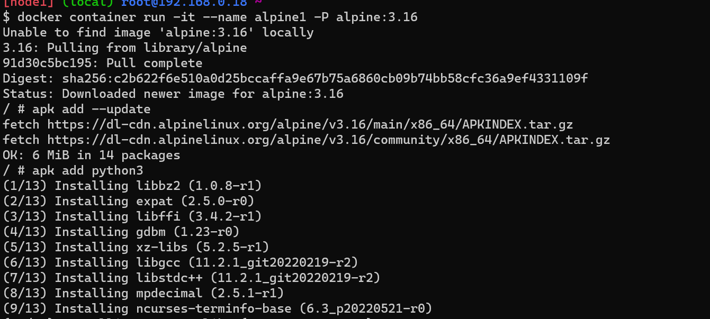
      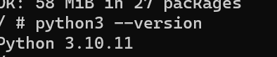
  
###Create an ubuntu container with sleep 1d then login user exec.Install python
  1. `docker container run -d --name py -P ubuntu:20.04 sleep 1d`,
  2. `docker container exec -it py /bin/bash`,
  3. `apt update`,`apt install python3` 
  4. `python3 --version`docker container exec -it py /bin/bash
      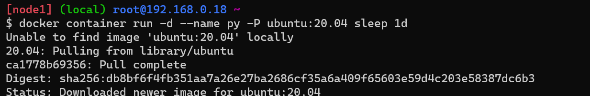
      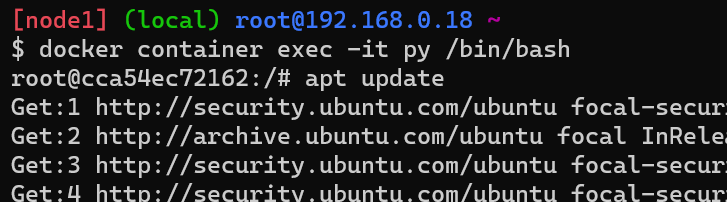
      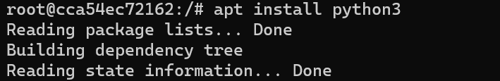
      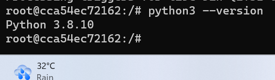

###Create a postgress container with user panoramic and password as trekking. try logging in and show the databases (querry for the psql)

 `docker container run -d --name database -e POSTGRES_USER=panoramic -e POSTGRES_PASSWORD=trekking -e POSTGRES_DB=psqldata -P postgres:15`,`docker exec -it database /bin/bash`,`psql --help`
        
        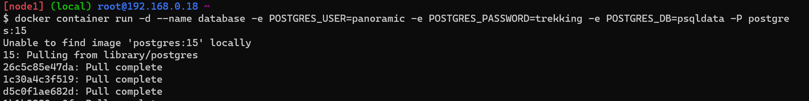
        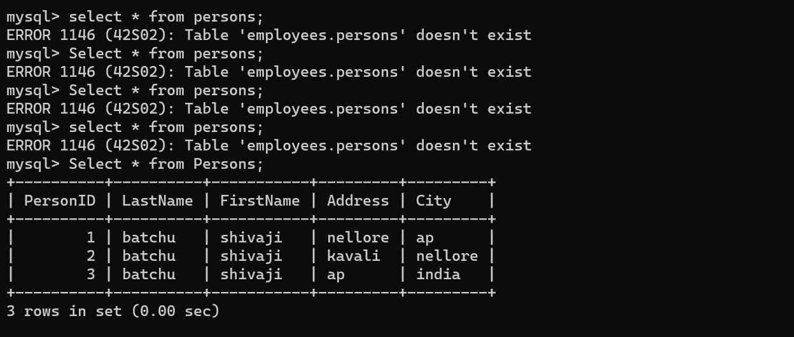

-----------------------------------------------------------------------        
### create a my self database(mysql)
 1. `docker container run -d -P --name mysql -e MYSQL_ROOT_PASSWORD=shivaji -e MYSQL_DATABASE=employees -e MYSQL_USER=qtuser -e MYSQL_PASSWORD=shivaji mysql:8`

 2.`docker container exec -it mysql mysql --password=shivaji`
 3.`mysql> use employees;

  CREATE TABLE Persons (
        PersonID int,
        LastName varchar(255),
        FirstName varchar(255),
        Address varchar(255),
        City varchar(255)
    );`
 4.`Insert into Persons values (1,'batchu','shivaji','nellore','ap'),(2,'batchu','shivaji','kavali','nellore'),(3,'batchu','shivaji','ap','india');`
 5.`select * from persons;`
  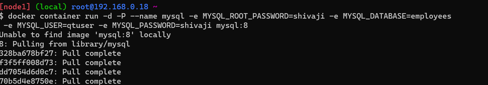
  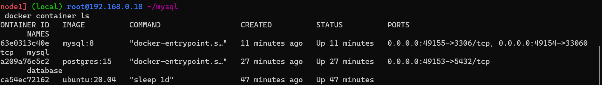
  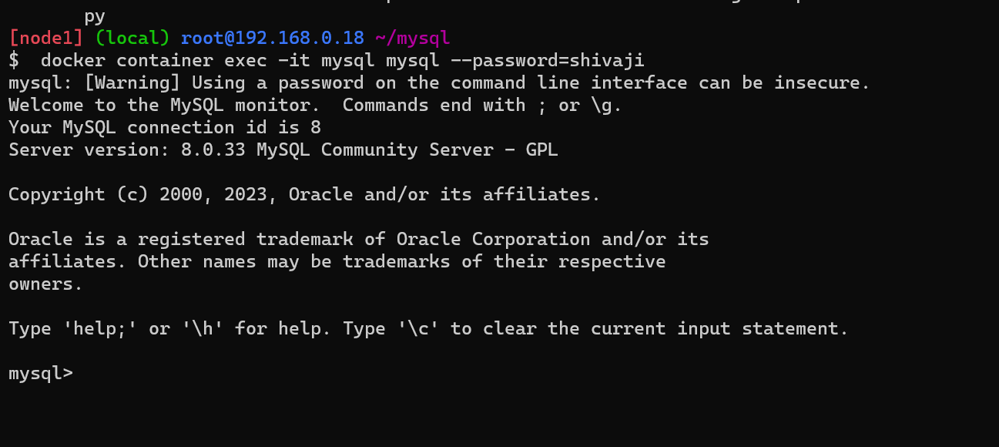
  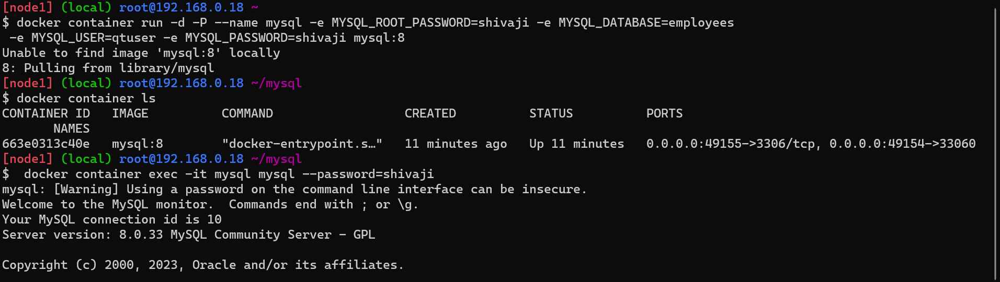
  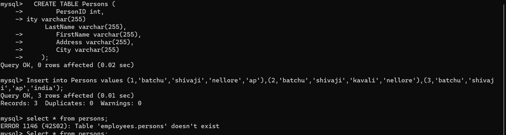
  
 ------------------------------------------------------------------------------
### 4.Try to create a dockerfile which runs phpinfo page, use ARG and ENV wherever appropriate on 1.apache, 2.nginx
 `sudo apt update`
`sudo apt install apache2 -y`
`sudo apt install php libapache2-mod-php -y`
`FROM ubuntu:22.04`
`LABEL author="shivaji" org="qt" project="apche2"`
`ARG DEBIAN_FRONTEND=noninteractive`
`RUN apt update && \
    apt install vim -y && \
    apt install apache2 -y && \
    apt install php -y && \
    apt install libapache2-mod-php -y`
` WORKDIR /var/www/html`
`COPY /info.php /var/www/html/info.php`
`EXPOSE 80`
`CMD [ "apache2ctl","-D","FOREGROUND" ]`
1.'docker image build -t apache:v1.0.0 .'
2.'docker container run -d -P --name apachephp2 apache:v1.0.0'

1.created info.php file in local
2.docker image build -t apache:v1.0.0 .
3.docker container run -d -P --name apachephp2 apache:v1.0.0
 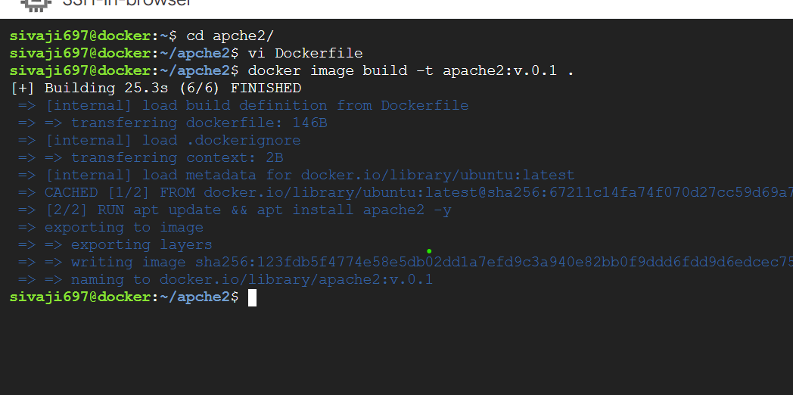
  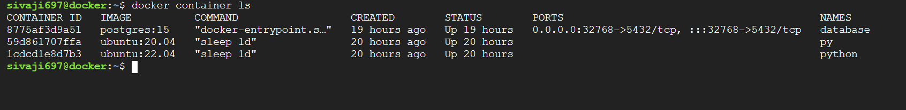
  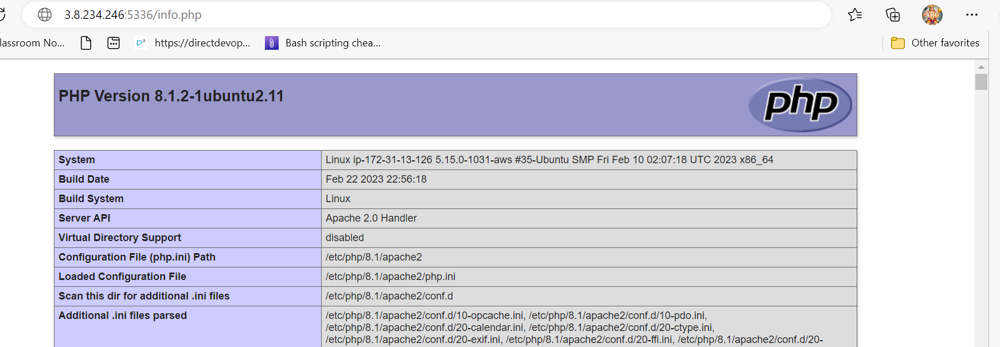
------------------------------------------------------------------------------

### 5. Create a jenkins image by craeting a own docker file
`FROM ubuntu:latest
RUN  apt update && apt install openjdk-8-jdk -y && apt install maven -y && apt install git -y 
RUN  git clone https://github.com/hemachaitanya/game-of-life.git && cd game-of-life && mvn package
EXPOSE 9090
CMD [ "java","-jar"," target/game-of-life-1.0-SNAPSHOT.jar" ]`

1.`docker image build -t jenkins:v1.0 .`
2.`docker container run -d -P --name jenkins jenkins:v1.0`
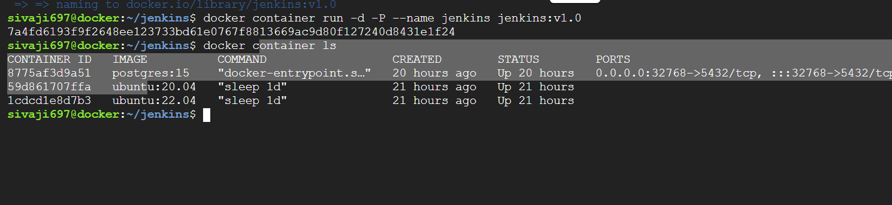
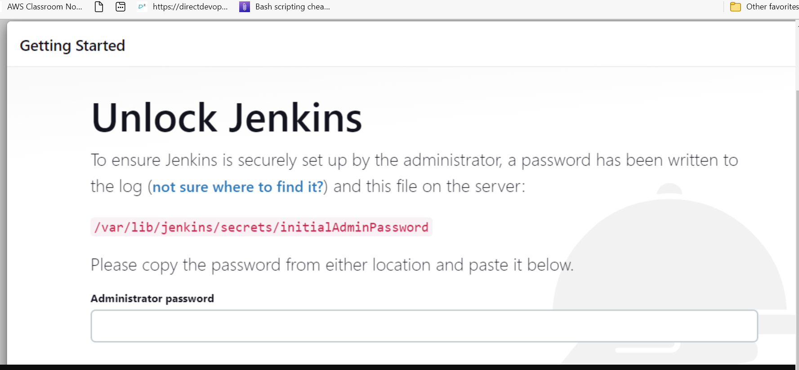
---------------------------------------------------------------
### 6. Create nop commerce and mysql server and try to make them work by configuring
`FROM mcr.microsoft.com/dotnet/sdk:7.0`
`LABEL author="shivaji" org="qt" project="nopcommerse"`
`ADD https://github.com/nopSolutions/nopCommerce/releases/download/release-4.60.2/nopCommerce_4.60.2_NoSource_linux_x64.zip /nop/nopCommerce_4.60.2_NoSource_linux_x64.zip`
`WORKDIR /nop`
`RUN apt update && \`
`apt install unzip -y && \`
`unzip /nop/nopCommerce_4.60.2_NoSource_linux_x64.zip && \`
`mkdir /nop/bin && mkdir /nop/logs`
`EXPOSE 5000`
`CMD [ "dotnet", "Nop.Web.dll", "--urls", "http://0.0.0.0:5000" ]`

1.`docker image build -t nop:v1.0 .`
2.`docker network create mybridge --subnet "10.0.0.0/24"`
3.`docker container run -d --name mysql --network mybridge -v mysqlvol:/var/lib/mysql -e MYSQL_ROOT_PASSWORD=password -e MYSQL_USER=qtuser -e MYSQL_PASSWORD=shivaji mysql:8`
4.`docker container run -d -P --name nop --network mybridge -e MYSQL_SERVER=mysql nop:v1.0`
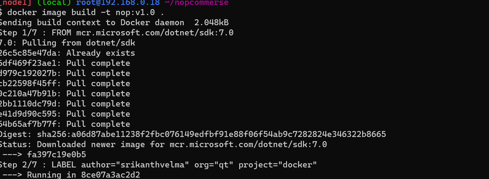
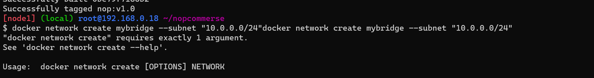
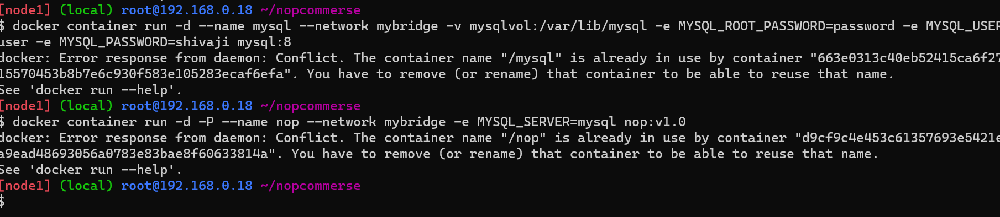
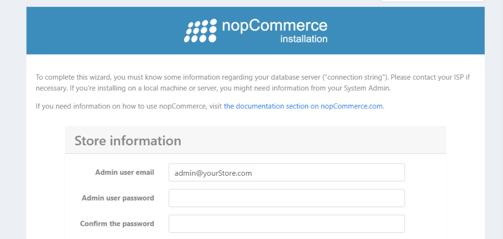
    

                workbook3
                --------
----
### multi-stage docker file to build 
##new

